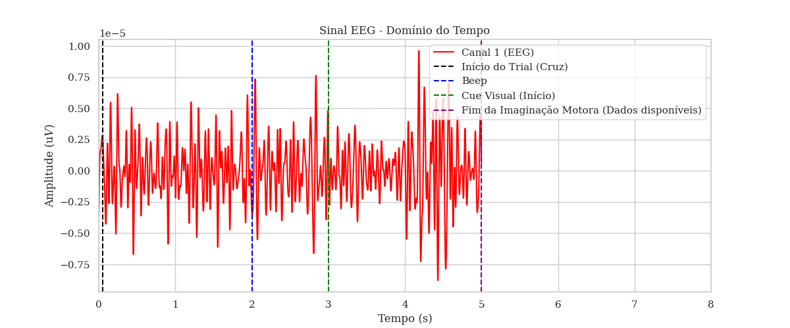
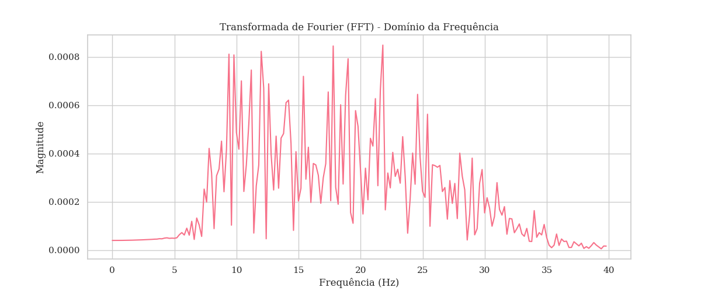
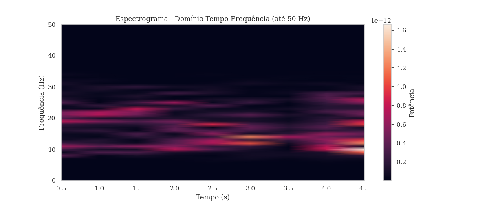
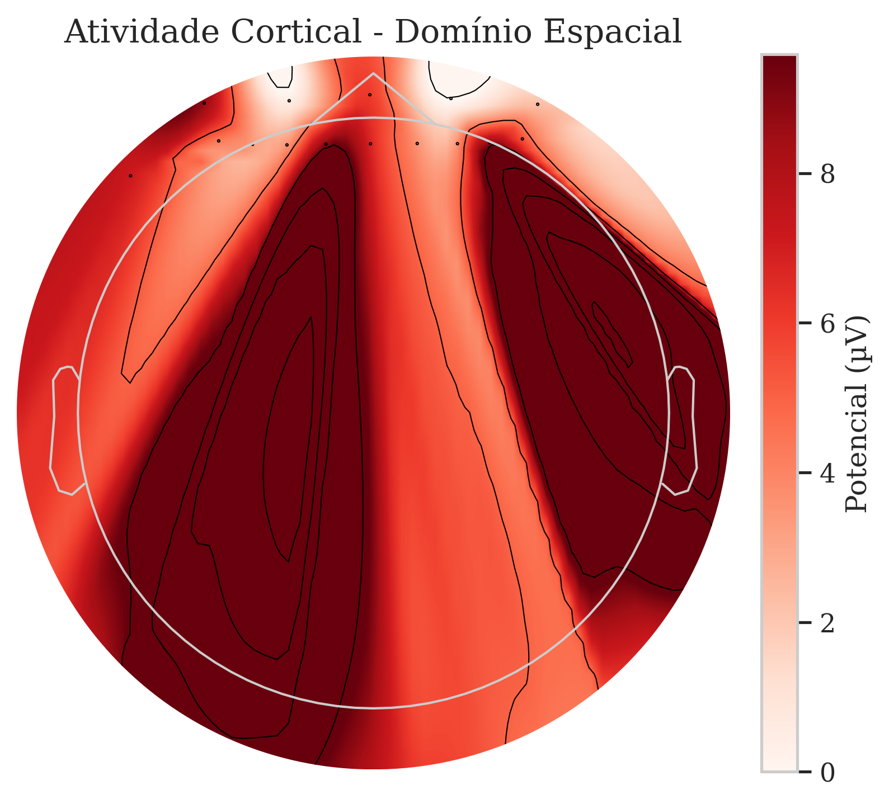

# Trabalho 3 - MOABB Dataset

Este repositório contém a implementação do **Trabalho 3** utilizando o dataset **MOABB (Mother of All BCI Benchmarks)** para análise de sinais EEG em tarefas de Imagery Motor. O objetivo do projeto é analisar o dataset **BNCI2014001** e avaliar diferentes abordagens para o processamento dos sinais cerebrais, utilizando técnicas de aprendizado de máquina e estatística para extrair padrões significativos.

## 📂 Estrutura do Projeto

```
📦 bcifinalwork
 ┣ 📂 results              # Resultados das análises, gráficos e métricas
 ┣ 📜 README.md            # Este arquivo
 ┣ 📜 requirements.txt      # Dependências do projeto
 ┗ 📜 analise_bnci2014.py              # Código principal do projeto
```

## 📊 Resultados

Os gráficos abaixo representam as análises realizadas no projeto.

### **1. Comparação entre classes**



### **2. Distribuição da Dimensão Fractal**



### **3. Precisão Antes e Depois do Alinhamento**



### **4. Sinais EEG Antes e Depois do Processamento**



## 🛠️ Instalação

Para executar o projeto, instale as dependências com:

```bash
pip install -r requirements.txt
```

## 🚀 Execução

O código pode ser executado da seguinte forma:

```bash
python analise_bnci2014.py
```

## 📚 Referências

- MOABB: https://github.com/NeuroTechX/moabb
- Papers sobre análise de EEG e Machine Learning
